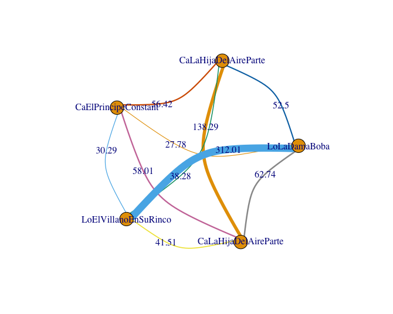

# Scripts in R to prepare a corpus for TRACER

[TRACER](https://www.etrap.eu/research/tracer) is a set of algorithms for detecting text reuse across texts.  

The corpus needs to be prepared following a specific column structure, as explained in the [TRACER manual. Corpus preparation](https://tracer.gitbook.io/-manual/manual/corpus-preparation). TRACER uses plain text files (.txt). For these scripts you need to put each work in a .txt file within the same folder (see the comments in the scripts for more info).

`Tracer_Corpus_Preparation_verses.R` automates the preparation for a corpus of theatre plays (verses are defined with newline character `\n`). Didascalia, speakers, etc. have been removed (The sample texts are not included in the repository due to licence restrictions).

```
	id      texto                          fecha file_list            
   <chr>   <fct>                          <chr> <chr>                
 1 0100001 cantad aqui que ha gustado     NULL  CaElPrincipeConstante
 2 0100002 mientras toma de vestir        NULL  CaElPrincipeConstante
 3 0100003 fenix hermosa de oir           NULL  CaElPrincipeConstante
 4 0100004 las canciones que ha escuchado NULL  CaElPrincipeConstante
 5 0100005 tal vez en los banos llenas    NULL  CaElPrincipeConstante
 6 0100006 de dolor y sentimiento         NULL  CaElPrincipeConstante
 7 0100007 musica cuyo instrumento        NULL  CaElPrincipeConstante
 8 0100008 son los hierros y cadenas      NULL  CaElPrincipeConstante
 9 0100009 que nos aprisionan puede       NULL  CaElPrincipeConstante
10 0100010 haberla alegrado               NULL  CaElPrincipeConstante
# ... with 16,870 more rows
```

TRACER offers the possibility of visualise the [results in a tabular format](https://tracer.gitbook.io/-manual/beta/results-as-csv). The scripts in `DefaultOutputterMain.R` just reads into R the `score.expanded.csv` and modifies the table to remove, e.g., redundant results or the reuse within the same work.

```
   V1 V2 V3     V4                      V5                        V6 total parcial
1 03 01  2 0.4000    en esta parte espere  haced alto en esta parte FALSE   FALSE
2 03 01  3 0.4285   al rey mi senor y asi con salva al rey mi senor FALSE   FALSE
3 05 01  2 0.3333 por los montes de paris   a los montes de ascalon FALSE   FALSE
5 02 01  2 0.4000 a sus trompetas y cajas    alli trompetas y cajas FALSE   FALSE
```

Once you have the results in this format a [network analysis](https://www.etrap.eu/english-translations-of-pan-tadeusz-a-comparison-with-tracer/) is also possible. Scripts forthcoming... 




`Tracer_Corpus_Preparation_sentences.R` does not differ much from `Tracer_Corpus_Preparation_verses.R`. It automates the preparation for a corpus tokenizing it by sentences. 

```
  id      texto                                                                           fecha file_list        
  <chr>   <fct>                                                                           <chr> <chr>            
1 0100001 cantad aqui que ha gustado mientras toma de vestir fenix hermosa de oir las ca… NULL  CaElPrincipeCons…
2 0100002 musica cuyo instrumento son los hierros y cadenas que nos aprisionan puede hab… NULL  CaElPrincipeCons…
```